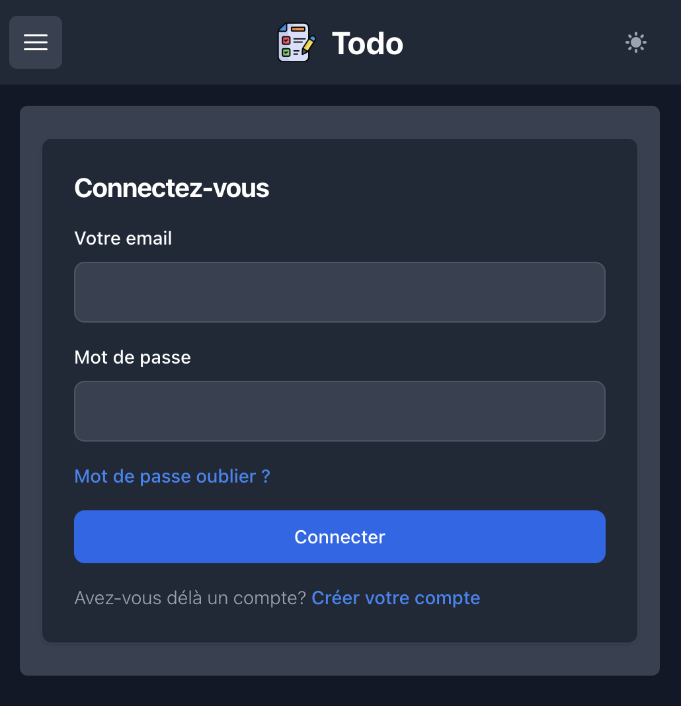
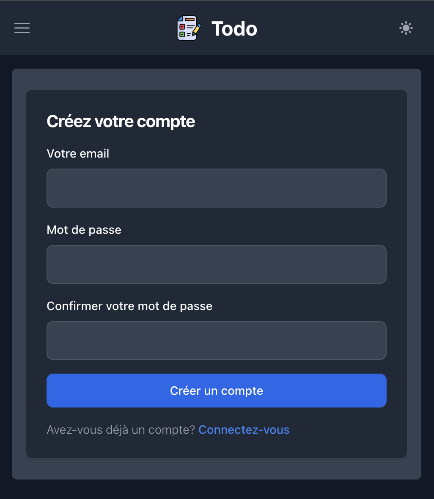
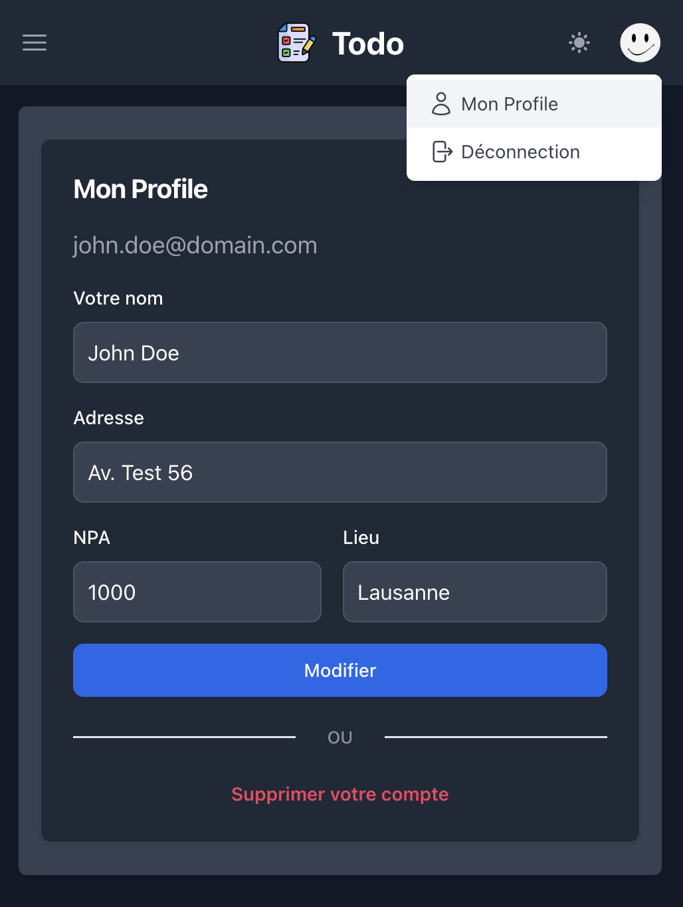
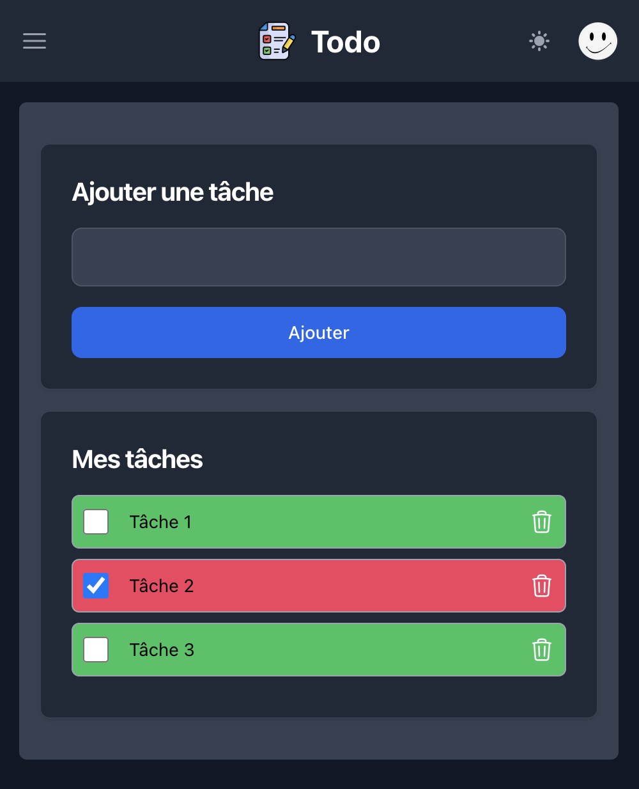

# todo-app

---

---

This simple Todo app use in frontend made with Vue.js 3 using TypeScript and 
TailWinCSS for the HTML view.

The backend API is made with Node.js 20+ and Express and MongoDB for data storage.

The frontend offer the possibility to switch from *Dark* ot *Light* theme.

## The interface

# Login

# Register

# Profile

# Todos

